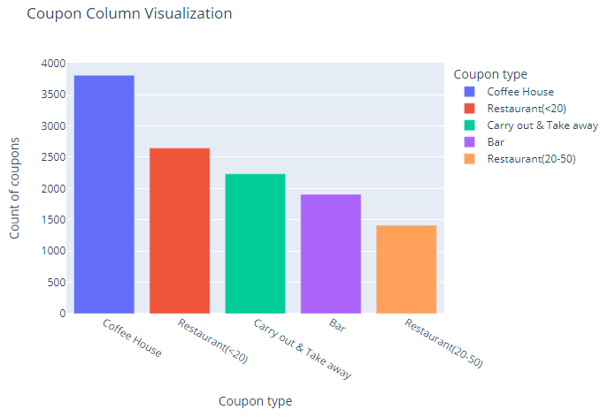
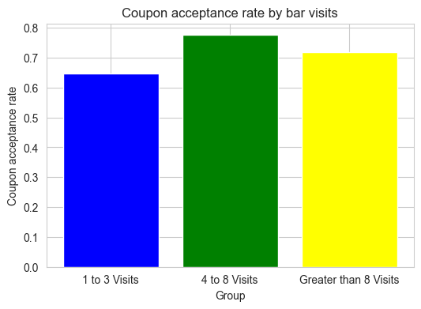
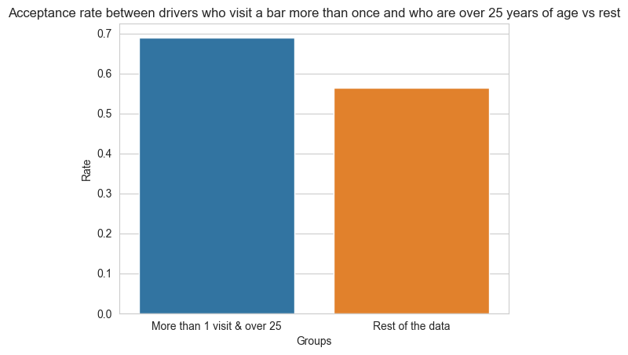
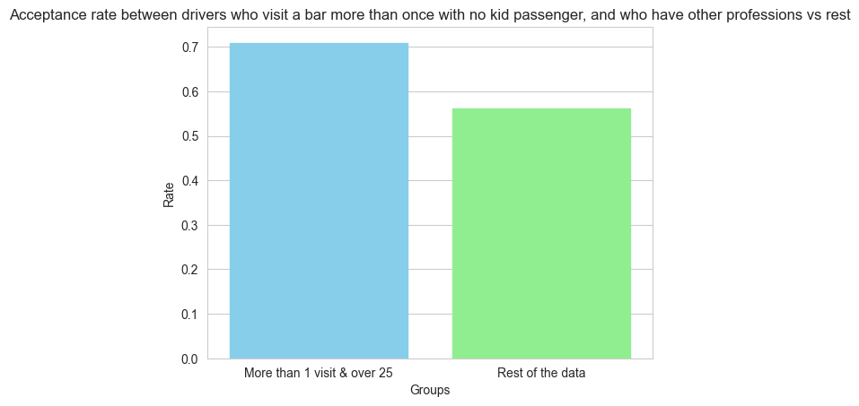
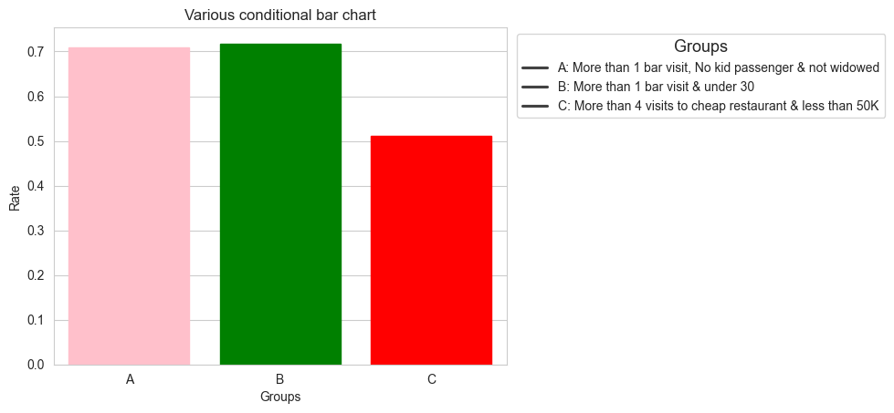

# 
 Will a Customer Accept the Coupon?

This Python application using Jupyter Notebook explores a dataset containing information of ~13,000 people in order to determine which factors make them accept a driving coupon.

[Jupiter Notebook used](https://github.com/Balu-A/AmazonProject/blob/master/AmazonCouponApplication.ipynb)

The current CRISP-DM Process Model for Data Mining (see Figure 1) was followed.

  
  <h4 align="center">Figure 1</h4>

<h1 style="text-align: center; color: blue;">Will a Customer Accept the Coupon?</h1>

This Python application using Jupyter Notebook explores a dataset containing information of ~13,000 people in order to determine which factors make them accept a driving coupon.

<a href="https://github.com/Balu-A/AmazonProject/blob/master/AmazonCouponApplication.ipynb" target="_blank">Jupiter Notebook used</a>

 The current CRISP-DM Process Model for Data Mining (see Figure 1) was followed.

<h4 align="center"> Figure 1</h4>

<h2>Business Understanding</h2>
The Business task is to identify which factors make a customer accept a coupon delivered over the phone by using python & its libraries in jupyter notebook. This application will use visualizations 
and probability distributions to distinguish between customers who accepted a driving coupon versus those that did not.

<h2>Data Understanding</h2>
The dataset (coupons.csv) given is in .csv format.It consisted of 26 columns and ~13000 rows as shown below (see Figure 2). The target column is "Y" which is boolean. 
There are only 8 columns that are numerical and the rest are categorical (ordinal and nominal). Columns such as "car", "Bar", "Coffee House", "CarryAway", "Restaurant<20", and 
"Restaurant 20To50" contain a bunch of "NaN" values. Duplicates were also observed. It is thought that in order to provide  more insight into the aforementioned dataset, 
a data preparation, i.e, data cleaning process needs to be done first.
 
 

<h4 align="center"> Figure 2</h4>

<h2>Data Preparation</h2>
The first step was to drop the null values (see Figure 3), and also make sure that there aren't any duplicates present in the dataset as well. As it is observed in Figure 4, 
all the columns now have same number of rows with no null values.
 

<h4 align="center"> Figure 3</h4>

 
After cleaning up null values and dupes

<h4 align="center"> Figure 4</h4>

<h2>Analysis and Visualization</h2>
<h3>Observation 1:</h3> Among the accepted coupons, CoffeeHouse coupons are widely accepted, followed by coupons for cheap restaurants 

<h4 align="center"> Figure 5</h4>

 
<h3>Observation 2:</h3> Among the transmitted Bar coupons, only 41% of the coupons were accepted 

 
<h3>Observation 3:</h3> Among bar-goers, people who frequented bars between 4 and 8 visits per month are more likely to accept the bar coupon. Equally probable are the lot who visited a bar more than 8 times a month 

<h4 align="center"> Figure 6</h4>

 
<h3>Observation 4:</h3> Bar-goers who are more than 25 yo and who visited a bar more than once a month are more likely to accept a bar coupon than the remaining data set 

<h4 align="center"> Figure 7</h4>

 
<h3>Observation 5:</h3> Bar-goers who visited a bar more than once a month, who didn't travel with a kid, and who did work in Farming, Fishing, and Forestry are more likely to accept a bar coupon. This is possibly because those
who work in farming/forestry/fishing may have impeding factors such a work schedule and proximity to a bar 

<h4 align="center"> Figure 8</h4>

<h3>Observation 6:</h3> Bar-goers who visited a bar more than once a month, who didn't travel with a kid, and who were not widowed are more likely to accept a bar coupon than those whose income <$50K. This is probably 
because low-income people prefer to go to a restaurant instead to a bar.

<h4 align="center"> Figure 9</h4>

<h3>Overall Hypothesis:</h3> 
If a person is between 25 and 30 years of age and they love going to a bar more than 3 times a month, then there is high likelihood of that person accepting a bar coupon. 

